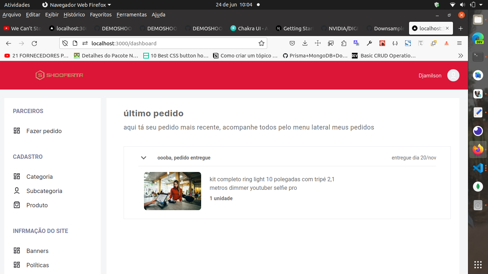

# Getting Started

## Download the data

See [Standard Datasets](StandardDatasets.md) for details about this script.

## Using the Webapp

### Logging in

### Creating a Dataset

While the job is running, you should see the expected completion time on the right side:

