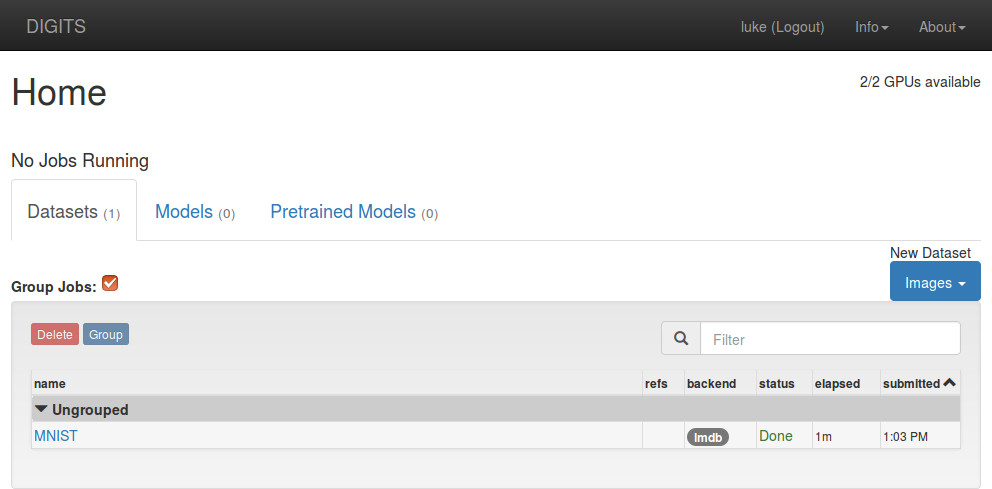

See [Front-end Client](BACK-END.md) for details about this script.

## Using the Webapp

### Logging in

This will lead you to the login page:

> NOTE: there is no authentication - you don't even need a password.
> This is a utility feature, not a security feature.

### Creating a Dataset

